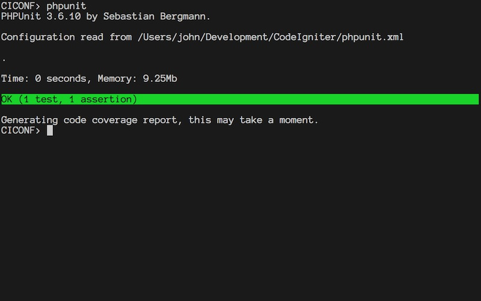
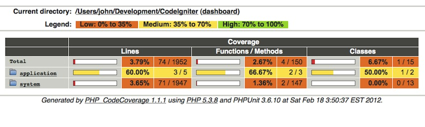

!SLIDE
# PHPUnit (sans CIUnit)
## By Sebastian Bergmann

!SLIDE
# Installation

!SLIDE
# PEAR
## PHP Extension and Application Repository
	@@@ sh
	$ wget http://pear.php.net/go-pear.phar
	$ php -d go-pear.phar

!SLIDE
# XDebug
## Stack Traces and Tracking
	@@@ sh
	$ brew install xdebug

!SLIDE
# PHPUnit
## Testing Framework + More
	@@@ sh
	$ pear channel-discover pear.phpunit.de
	$ pear channel-discover
		pear.symfony-project.com
	$ pear update-channels
	$ pear install --alldeps phpunit/PHPUnit

!SLIDE
# phpunit.xml

!SLIDE
	@@@ xml
	<phpunit>
		...
	</phpunit>

!SLIDE
	@@@ xml
	<phpunit colors="true">
		...
	</phpunit>

!SLIDE
	@@@ xml
	...
	<testsuites>
		<testsuite name="CI">
			<directory suffix="_test.php">
				test
			</directory>
		</testsuite>
	</testsuites>
	...

!SLIDE
	@@@ xml
	<phpunit colors="true"
		bootstrap="test/bootstrap.php">
		...
	</phpunit>

!SLIDE center

!SLIDE
# Assertions
* assertEquals
* assertEmpty
* assertGreaterThan
* assertNotNull
* assertInstanceOf

!SLIDE
# Order
## Always `<expectation, actual>`

!SLIDE
	@@@ php
	function testEquals() {
		$this->assertEquals(2, 2);
	}

!SLIDE
	@@@ php
	function testObject() {
		$john = new stdClass();
		$john->name = 'john';
		$this->assertObjectHasProperty('name', $john);
	}

!SLIDE
	@@@ php
	// @expectedException SomeException
	function testException() { }

!SLIDE
# Fixtures
* setUp
* tearDown
* setUpBeforeClass
* tearDownAfterClass

!SLIDE
	@@@ php
	function setUp() {
		$this->name = 'john';
	}
	function testName() {
		$this->assertEquals('john', $this->name);
	}

!SLIDE
# Code Coverage
## .. as a guideline

!SLIDE
	@@@ xml
	...
	<logging>
		<log type="coverage-html"
			target="coverage"/>
	</logging>
	...

!SLIDE
	@@@ xml
	...
	<logging>
		<log type="coverage-html"
			target="coverage"
			highlight="true"/>
	</logging>
	...

!SLIDE center

!SLIDE
	@@@ xml
	...
	<filter>
		<blacklist>
			<directory>system</directory>
			<directory>application/config</directory>
		</blaclist>
	</filter>
	<logging>...</logging>
	...
