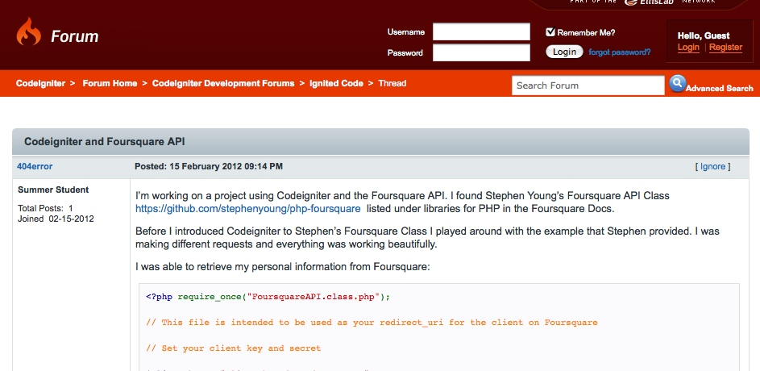
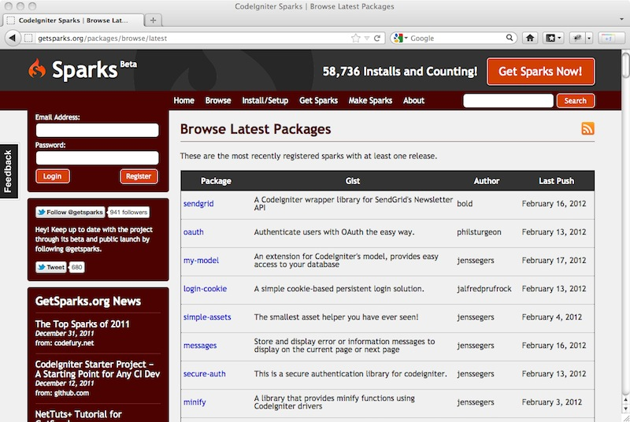

!SLIDE
!SLIDE
# Sparks
## [getsparks.org](http://getsparks.org/)

!SLIDE incremental
# What is Sparks?
* Distribution Tool
* Dependency Management
* Place to be, where things don't disappear

!SLIDE center

!SLIDE center

!SLIDE
# 154 Sparks!

!SLIDE
# How to install: Today
	@@@ sh
	$ php -r
		"$(curl -fsSL
		 http://getsparks.org/go-sparks)"

!SLIDE
# How to install: Tomorrow
## [EllisLab/CodeIgniter/feature/sparks](https://github.com/EllisLab/CodeIgniter/tree/feature/sparks)

!SLIDE
# Ask me questions
## Find me, let me know what you think
